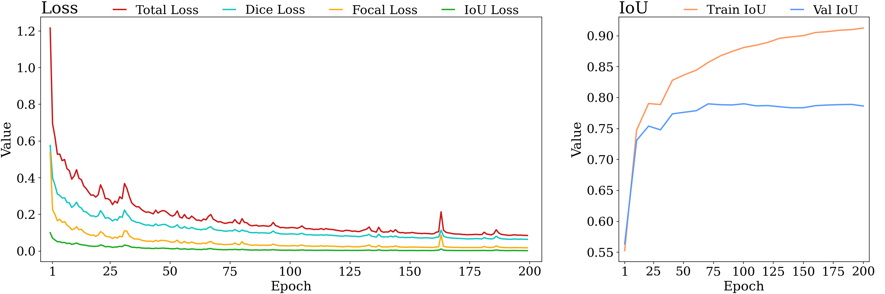
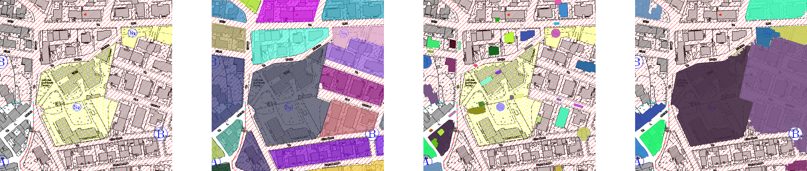
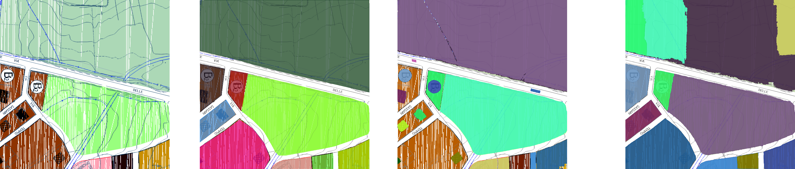
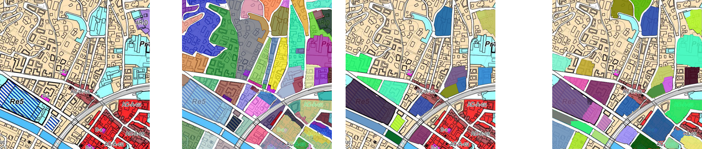
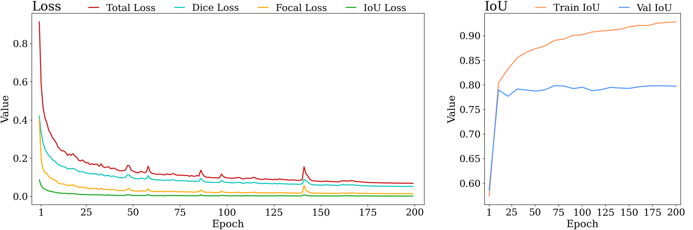
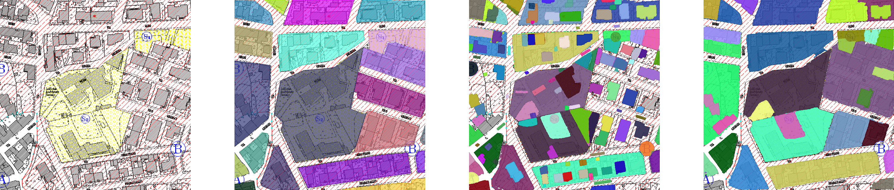
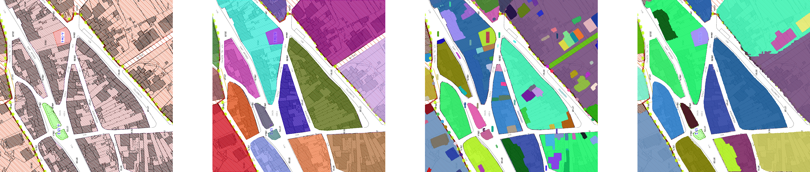
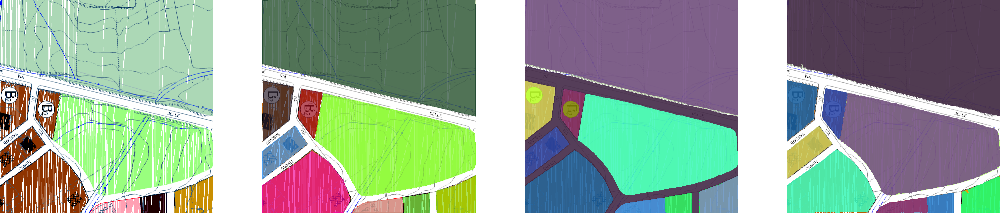
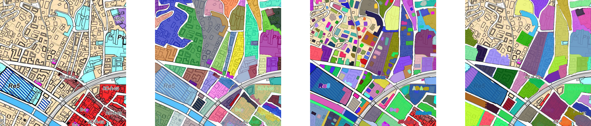

# finestSAM

This project was carried out as part of the thesis at the University of Cagliari by:


* [`Marco Pilia`](https://github.com/Marchisceddu)
* [`Simone Dessi`](https://github.com/Druimo)

The main goal is to perform fine-tuning of the Segment-Anything model by MetaAI on a custom dataset in COCO format, with the aim of providing an effective implementation for predictions using SAM's automatic predictor.
The code utilizes the Fabric framework from Lightning AI to offer an efficient implementation of the model.

To read the full research conducted for solving the task, you can consult the thesis (in Italian) at [`link`](https://drive.google.com/file/d/1JJwgVJOXWdbUqyN0FSMuvoJxFhoqSF4g/view?usp=sharing)

## Dataset

To add a COCO-formatted dataset into the main directory, you should structure your dataset directory as follows:

```python
dataset/
├── images/  # Folder containing the dataset images
│   ├── 0.png
│   ├── 1.png
│   └── ...
└── annotations.json  # COCO-formatted annotations file
```

To specify the name of the dataset in the model, modify the relevant settings as explained in the Config section of the [`finestSAM/config.py`](https://github.com/Marchisceddu/finestSAM/blob/main/finestSAM/config.py). By default, the model expects a folder named `"dataset"`. Ensure that the dataset path is correctly referenced in this file for proper integration.

## Setup

Here are the steps to follow:

1. **Download the SAM model checkpoint**  
   The instructions for downloading the SAM model checkpoint can be found in the [`finestSAM/sav/`](https://github.com/Marchisceddu/finestSAM/blob/main/finestSAM/sav/) directory.

2. **Install necessary dependencies:**

    - Install dependencies using pip by running the following command from the project directory:
      ```bash
      pip install -r requirements.txt
      ```

    - Alternatively, you can create a Conda environment using the provided `environment.yaml` file:
      ```bash
      conda env create -f environment.yaml
      ```

This will ensure that all required packages and libraries are installed and ready for use.

## Config

The hyperparameters required for the model are specified in the file [`finestSAM/config.py`](https://github.com/Marchisceddu/finestSAM/blob/main/finestSAM/config.py)

<details>

<summary> Here's a detailed summary of the configuration structure for the model: </summary>

### **General Configuration**:
```python
"device": str = "auto" or "gpu" or "cpu", # Hardware to run the model (mps not supported; set to cpu for Mac M1)
"num_devices": int or (list of str) or str = "auto", # Number of devices or list of GPUs or auto to select the best device
"num_nodes": int, # Number of GPU nodes for distributed training
"seed_device": int / None for random,
"sav_dir": str, # Output folder for model saves
"out_dir": str, # Output folder for predictions

"model": {
    "type": str = "vit_h" or "vit_l" or "vit_b", # Model type
    "checkpoint": str, # Checkpoint name in .pth format
},
```

### **Training Configuration**:
```python
"seed_dataloader": int / None for random,
"batch_size": int, # Batch size for images
"num_workers": int, # Number of subprocesses for data loading (0 means loading in the main process)

"num_epochs": int, # Number of training epochs
"eval_interval": int, # Validation interval
"prompts": {
    "use_boxes": bool, # Whether to use bounding boxes for training
    "use_points": bool, # Whether to use points for training
    "use_masks": bool, # Whether to use annotations for training
    "use_logits": bool, # Whether to use logits from the previous epoch (if True, ignore use_masks)
},
"multimask_output": bool,

"opt": {
    "learning_rate": int, # Learning rate
    "weight_decay": int, # Weight decay
},

"sched": {
        "type": str = "ReduceLROnPlateau" or  "LambdaLR",
        "LambdaLR": {
            "decay_factor": int, # Learning rate decay factor using the formula -> 1 / (decay_factor ** (mul_factor+1))
            "steps": list int, # List of steps at which the LR should decay
            "warmup_steps": int, # Number of epochs for LR warmup
        },
        "ReduceLROnPlateau": {
            "decay_factor": float (0-1), # LR decay factor (e.g., lr * factor)
            "epoch_patience": int, # Patience for LR decay
            "threshold": float,
            "cooldown": int,
            "min_lr": int,
        },
    },

"losses": {
    "focal_ratio": float, # Weight of focal loss in the total loss
    "dice_ratio": float, # Weight of dice loss in the total loss
    "iou_ratio": float, # Weight of IoU loss in the total loss
    "focal_alpha": float, # Alpha value for focal loss
    "focal_gamma": int, # Gamma value for focal loss
},

"model_layer": {
    "freeze": {
        "image_encoder": bool, # If True, freeze image encoder layer
        "prompt_encoder": bool, # If True, freeze prompt encoder layer
        "mask_decoder": bool, # If True, freeze mask decoder layer
    },
},

"dataset": {
    "auto_split": bool, # If True, splits the dataset for validation
    "seed": 42,
    "use_cache": bool, # if True, attempt to load/save precomputed dataset metadata to sav_path
    "split_path": {
        "root_dir": str,
        "images_dir": str,
        "annotation_file": str,
        "sav": str, # Remove old saves on setting changes
        "val_size": float (0-1), # Validation dataset size percentage
    },
    "no_split_path": {
        "train": {
            "root_dir": str,
            "images_dir": str,
            "annotation_file": str,
            "sav": str, # Remove old saves on setting changes
        },
        "val": {
            "root_dir": str,
            "images_dir": str,
            "annotation_file": str,
            "sav": str, # Remove old saves on setting changes
        },
    },
    "positive_points": int, # Number of positive points passed with __getitem__
    "negative_points": int, # Number of negative points passed with __getitem__
    "use_center": True, # The first positive point is always the most significant for each mask
    "snap_to_grid": True, # Align the center to the prediction grid used by the automatic predictor
}
```

### **Prediction Configuration**:
```python
"opacity": float,  # Transparency of predicted masks when displaying the image
```

</details>

## Run model

To execute the file [`finestSAM/__main__.py`](https://github.com/Marchisceddu/finestSAM/blob/main/finestSAM/__main__.py), use the following command-line arguments, depending on the task you want to perform:

### **Training the Model:**
   Run the training process by specifying the `--mode` as "train":

   ```bash
   python -m finestSAM --mode "train"
   ```

### **Automatic Predictions:**
   For making predictions, use the `--mode` as "predict" and specify the input image path:

   ```bash
   python -m finestSAM --mode "predict" --input "path/to/image.png"
   ```

   Optionally, you can also modify the opacity of the predicted masks with the `--opacity` argument. The default value is 0.9:

   ```bash
   python -m finestSAM --mode "predict" --input "path/to/image.png" --opacity 0.8
   ```


In addition to running the script directly, there is an [`example notebook`](https://github.com/Marchisceddu/finestSAM/blob/main/notebook.ipynb) available for better understanding and easy experimentation.

## Results

The fine-tuning of the model was carried out to perform efficient instance segmentation, specifically for generating polygons that delimit urban areas in PDFs. These PDFs represent urban planning tools that regulate land transformations, such as areas where specific building restrictions apply. 

For this task, a single prompt was used during training: __1 central point per mask aligned with the automatic predictor grid.__ This prompt proved to be the most effective for training and ensuring the proper functioning of SAM's automatic predictor.

### Test sam vit_b
<details>

<summary> Training progress </summary>


 _Training progress for the sam_vit_b model_

</details>

<details>

<summary> Comparison images </summary>


 _`Original Image`_ , _`Ground Truth Masks`_ , _`SAM vit_b_ - _Masks`_ , _`Finetuning - Masks`_ 


 _`Original Image`_ , _`Ground Truth Masks`_ , _`SAM vit_b_ - _Masks`_ , _`Finetuning - Masks`_ 


 _`Original Image`_ , _`Ground Truth Masks`_ , _`SAM vit_b_ - _Masks`_ , _`Finetuning - Masks`_ 


 _`Original Image`_ , _`Ground Truth Masks`_ , _`SAM vit_b_ - _Masks`_ , _`Finetuning - Masks`_ 

</details>


### Test sam vit_h
<details>

<summary> Training progress </summary>


 _Training progress for the sam_vit_h model_

</details>

<details>

<summary> Comparison images </summary>


 _`Original Image`_ , _`Ground Truth Masks`_ , _`SAM vit_h_ - _Masks`_ , _`Finetuning - Masks`_ 


 _`Original Image`_ , _`Ground Truth Masks`_ , _`SAM vit_h_ - _Masks`_ , _`Finetuning - Masks`_ 


 _`Original Image`_ , _`Ground Truth Masks`_ , _`SAM vit_h_ - _Masks`_ , _`Finetuning - Masks`_ 


 _`Original Image`_ , _`Ground Truth Masks`_ , _`SAM vit_h_ - _Masks`_ , _`Finetuning - Masks`_ 

</details>


## To-Do List

- [ ] Added a function to predict using the manual predictor

- [ ] Added a function to create the bounding boxes for training (suggestion on line 175 [finestSAM/model/dataset.py](https://github.com/Marchisceddu/finestSAM/blob/main/finestSAM/model/dataset.py))

- [ ] Validation method based on SAM automatic predictor

- [ ] Test

- [ ] tpu support

## Resources

- [Segment Anything](https://github.com/facebookresearch/segment-anything)
- [Lightning AI](https://github.com/Lightning-AI/lightning)
- [lightning-sam](https://github.com/luca-medeiros/lightning-sam)

## License
The model is licensed under the [Apache 2.0 license](https://github.com/Marchisceddu/finestSAM/blob/main/LICENSE.txt).